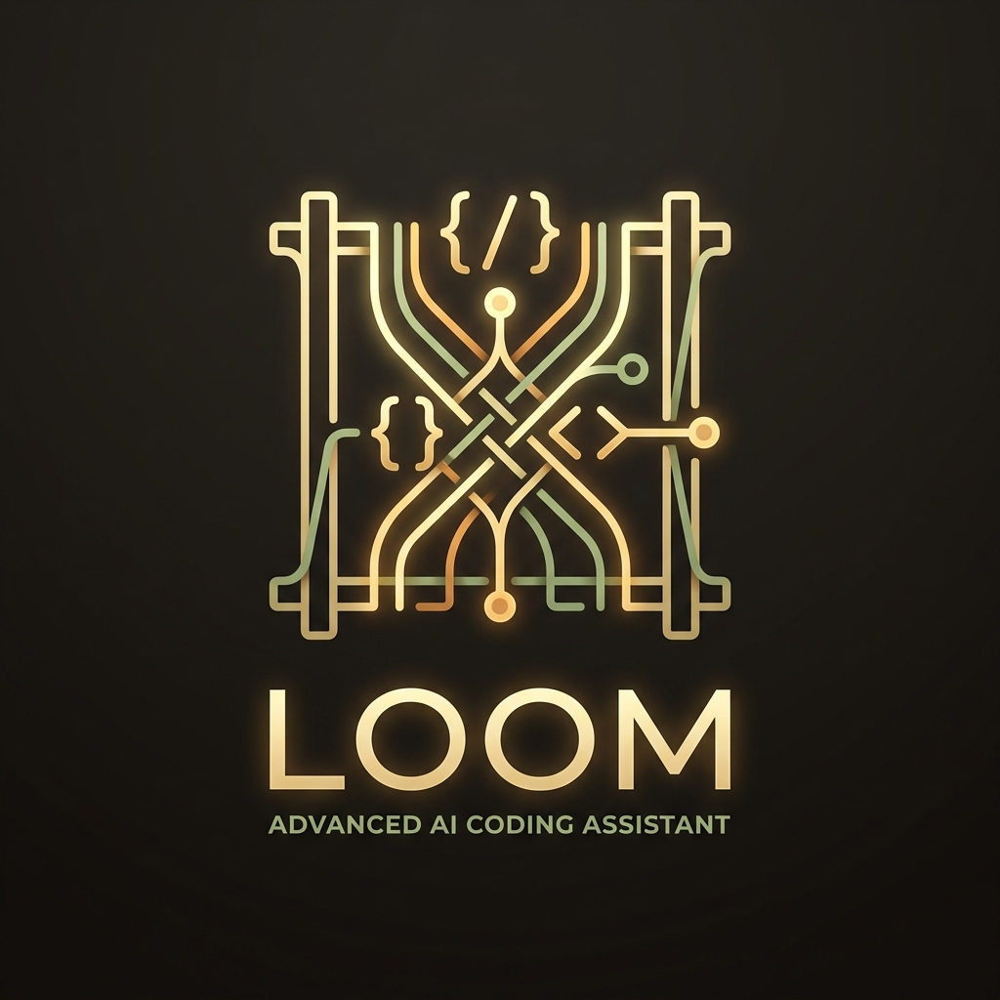

# Loom — Agent Framework

<p align="center">
  
</p>

> *A single thread may seem insignificant, but when many threads are precisely interwoven, they can be woven into any shape.*

**Loom** is a harness-first, memory-native, self-directing agent framework for anyone who cares not just about what an agent *can* do — but about what it *did*, who approved it, and what happens when it goes wrong.

---

## Why Loom?

Most agent frameworks treat tools as functions: define → call → done. That works in demos. It falls apart the moment you need audit trails, real authorization logic, long-term memory, or reliable autonomous operation.

Loom was built from a different premise: **every tool call is a first-class citizen with a lifecycle.**

Before a tool executes, it passes through a middleware pipeline that handles trust classification, schema validation, scope-aware authorization, and precondition gating. During execution, it races against abort signals. After execution, a post-validator can roll it back. Every state transition — success, failure, timeout, rollback — is recorded in memory and available for reflection.

This is what *harness engineering* means: the execution machinery around your tools is as important as the tools themselves.

---

## Core Values

| Principle | What it means |
|-----------|---------------|
| **Harness-first** | Every tool call flows through a structured middleware pipeline. Logging, tracing, trust control, and abort handling are built-in, not bolted on. |
| **Memory-native** | Memory is a substrate, not a plugin. Four types — episodic, semantic, procedural, relational — are core architecture, not an afterthought. |
| **Reflexive** | The agent observes its own execution history, self-assesses skill quality after each turn, and evolves low-performing skills automatically. |
| **Self-directing** | Cron, event, and condition triggers fire autonomously without human prompting. The autonomy engine shares the same middleware pipeline as interactive sessions. |
| **Model-agnostic** | Routes between cloud and local providers by model name prefix. Switch mid-session without losing context. |

---

## Architecture

Loom is organized into seven layers. Every tool call — whether from a human prompt, an autonomy schedule, or a sub-agent — passes through all of them.

```
┌─────────────────────────────────────────────────────────────┐
│                      Platform Layer                          │
│               CLI · TUI · Discord Bot                        │
├─────────────────────────────────────────────────────────────┤
│                     Cognition Layer                          │
│         LLM Router · Context Budget · Reflection API        │
├─────────────────────────────────────────────────────────────┤
│                   Harness Layer          ← the backbone      │
│   Middleware Pipeline · Trust Hierarchy · Action Lifecycle   │
│          Scope-Aware Authorization · Audit Trail             │
├─────────────────────────────────────────────────────────────┤
│                      Memory Layer                            │
│    Episodic · Semantic · Procedural (Skills) · Relational    │
├─────────────────────────────────────────────────────────────┤
│                      Task Engine                             │
│    TaskList · Async Jobs (JobStore + Scratchpad) · Spawn     │
├─────────────────────────────────────────────────────────────┤
│                     Autonomy Engine                          │
│       Cron Triggers · Event Triggers · Action Planner        │
├─────────────────────────────────────────────────────────────┤
│                   Extensibility Layer                         │
│         Lens System · Plugin Interface · Skill Import        │
└─────────────────────────────────────────────────────────────┘
```

---

## Harness Engineering

This is the core of what makes Loom different. Everything else — memory, autonomy, skills — sits on top of it.

### Three-Tier Trust

Every tool registered in Loom carries a trust level that determines how much human approval it requires:

| Level | Meaning | Behavior |
|-------|---------|----------|
| **SAFE** | Read-only, local, reversible | Pre-authorized at session start. Runs without prompting. |
| **GUARDED** | Writes, network access, side effects | Requires first-time confirmation; session-scoped approval persists. |
| **CRITICAL** | Destructive, irreversible, cross-system | Must confirm on every call. Cannot be session-authorized. |

Beyond trust levels, tools carry **capability flags** — `EXEC`, `NETWORK`, `AGENT_SPAN`, `MUTATES` — that give the middleware pipeline finer-grained control over what categories of action are permitted in any given context.

### Middleware Pipeline

All tool calls — regardless of origin — flow through the same ordered middleware chain:

```
harness.execute(name, args, session_state)
         │
         ▼
┌─────────────────────────┐
│  LifecycleMiddleware    │  ← outermost: DECLARED + post-OBSERVED + MEMORIALIZED
└─────────────────────────┘
         │
┌─────────────────────────┐
│  LogMiddleware          │  ← rich-formatted terminal output
│  TraceMiddleware        │  ← timing + episodic memory write
└─────────────────────────┘
         │
┌─────────────────────────┐
│  SchemaValidation       │  ← JSON schema validation; hallucinates-parameter guard
└─────────────────────────┘
         │
┌─────────────────────────┐
│  BlastRadiusMiddleware  │  ← trust classification + user confirmation
│                         │    writes authorization result to LifecycleContext
└─────────────────────────┘
         │
┌─────────────────────────┐
│  LifecycleGateMiddleware│  ← innermost: real-time control gates
│                         │    AUTHORIZED → PREPARED → EXECUTING → OBSERVED
└─────────────────────────┘
         │
         ▼
   tool handler runs
```

Middleware is stackable and pluggable — you can inject custom middleware at any position via the plugin system.

### Action Lifecycle

Every tool call is wrapped in an `ActionRecord` that lives inside a deterministic state machine. These states are not just labels — they are **real-time control gates**: each transition must complete before execution proceeds.

```
DECLARED → AUTHORIZED → PREPARED → EXECUTING → OBSERVED → VALIDATED → COMMITTED → MEMORIALIZED
                                       │                      │
                                    ABORTED               REVERTING → REVERTED → MEMORIALIZED
```

Terminal failure paths: `DENIED` / `ABORTED` / `TIMED_OUT` → always end in `MEMORIALIZED`.

This design means:
- **`AUTHORIZED`** — the pass/deny decision from `BlastRadiusMiddleware` is captured *before* dispatch, not inferred afterward
- **`PREPARED`** — skill-level precondition checks run here; failure aborts cleanly with zero side effects
- **`EXECUTING`** — fired at the *exact* moment the handler is called; races against an abort signal
- **`REVERTING → REVERTED`** — if a post-validator rejects the result, a registered rollback function can undo the effect
- **`MEMORIALIZED`** — every action, regardless of outcome, is written to memory and available for reflection

The two-layer design (`LifecycleMiddleware` outermost, `LifecycleGateMiddleware` innermost) exists for a precise reason: a single middleware cannot observe both *before* and *at* the exact moment the handler fires. Splitting into two cooperating layers solves this cleanly.

### Scope-Aware Authorization

Authorization in Loom operates at the **resource level**, not the tool level.

Instead of asking "do you approve `write_file`?", the system asks "do you approve writing under `doc/`?" — and remembers that answer.

```
write_file(path="doc/design.md")
    │
    ├─ scope_resolver → ScopeRequest(resource=path, action=write, selector=doc/)
    ├─ PermissionContext.evaluate()
    │     ├─ grant exists for doc/ → ALLOW (no prompt)
    │     ├─ no grant → CONFIRM (first-time prompt)
    │     └─ request is outside existing grant → EXPAND_SCOPE (red panel)
    └─ on confirmation → grant stored → future calls within scope auto-approve
```

Four response modes are available at every confirmation prompt: **approve once**, **scope lease (30-minute TTL)**, **permanent grant**, or **deny**. Active grants and their remaining TTL are always visible in the TUI budget panel or via `/scope` in any frontend.

---

## Memory System

Loom's memory is not a key-value store bolted onto a chat loop. It is a four-type system with its own governance layer, all backed by a single SQLite WAL database with vector search via `sqlite-vec`.

### Four Memory Types

| Type | Role |
|------|------|
| **Episodic** | Timestamped log of what happened — every tool call, every turn, with full lifecycle metadata. Auto-compressed after a configurable threshold. |
| **Semantic** | Long-term factual beliefs with confidence scores. Supports BM25 full-text search and embedding-based cosine similarity retrieval. |
| **Procedural** | Versioned skill instructions (`SkillGenome`). Quality tracked via EMA self-assessment; low-quality skills evolve or deprecate automatically. |
| **Relational** | Triple-store of entity relationships (`subject → predicate → object`). Powers cross-session reasoning and `dreaming` synthesis. |

### Multi-Fallback Recall

Memory retrieval is language-agnostic and always returns something:

```
recall(query)
  ├─ Tier 1: Embedding similarity (sqlite-vec)   — language-agnostic, semantic
  ├─ Tier 2: BM25 keyword ranking (SQLite FTS5)  — fast same-language path
  └─ Tier 3: Recency fallback                    — always returns a result
```

### Memory Governance

Every write to semantic memory passes through the `MemoryGovernor`:

```
write request
  ├─ classify_source()      → trust tier (user_explicit 1.0 → external 0.5)
  ├─ confidence floor       = max(entry.confidence, tier_floor)
  ├─ ContradictionDetector  → REPLACE / KEEP / SUPERSEDE based on trust comparison
  └─ upsert or reject

session end
  └─ Decay Cycle: episodic TTL prune · semantic low-confidence prune · relational dreaming decay
```

Trust tiers (highest → lowest): `user_explicit` → `tool_verified` → `agent_memorize` → `session_compress` → `counter_factual` → `agent_inferred` → `skill_evolution` → `dreaming` → `external`

Semantic confidence has a 90-day half-life. Memories that are never reinforced fade. Contradictions from lower-trust sources are suppressed. The system gradually builds a coherent, stable belief state across sessions.

---

## Skills — Procedural Memory with Self-Evolution

Skills are versioned instruction sets stored in `SkillGenome` that follow a three-tier progressive disclosure model:

| Tier | When loaded | What it contains |
|------|-------------|-----------------|
| **Tier 1** | Session startup | Name + description injected into system prompt — minimal context cost |
| **Tier 2** | On demand via `load_skill()` | Full instruction body, evolution hints, resource list |
| **Tier 3** | As needed | Agent reads bundled scripts, references, and assets directly |

Drop a `SKILL.md` into your `skills/` directory — Loom auto-imports it at session start.

### Structured Diagnostic Feedback Loop

After each turn where a skill was used, `TaskReflector` runs a background LLM self-assessment that produces a `TaskDiagnostic` — a structured record of which instructions were followed or violated, failure and success patterns, concrete `mutation_suggestions`, and a `quality_score` (1–5). The score feeds into the skill's `confidence` via EMA (α = 0.15). Skills whose confidence drops below a configurable threshold are deprecated and removed from the Tier 1 catalog.

### Skill Evolution Lifecycle

`TaskDiagnostic` data feeds a full candidate-pool evolution pipeline:

```
TaskReflector → TaskDiagnostic
                      ↓
              SkillMutator.propose_candidate()   ← single-turn background path
              SkillMutator.from_batch_diagnostic() ← meta-skill-engineer batch path
                      ↓
              SkillCandidate (skill_candidates table)
                      ↓
         generated → shadow → promoted   (or deprecated / rolled_back)
```

**Shadow mode** — a promoted candidate serves alongside the parent. `SkillGate` A/B-routes turns to shadow or parent body, accumulating a win record before promotion is confirmed.

**Fast-track** — when the `meta-skill-engineer` Grader proves ≥ 20% pass-rate improvement over the previous version, the candidate is flagged `fast_track=True` and can be promoted immediately without the shadow N-wins phase — Grader is the ground truth.

**Maturity tag** — `SkillGenome.maturity_tag` (`mature` / `needs_improvement`) is set by the operator after reviewing eval history; visible in `loom review <name>`.

**Version history** — every `promote` and `rollback` snapshots the previous body to `skill_version_history`. Full rollback is always available: `loom skill rollback <name>`.

```bash
loom skill candidates          # browse the candidate pool
loom skill promote <id>        # promote a shadow candidate
loom skill rollback <name>     # restore the previous body
loom skill history <name>      # full version archive
loom review <name>             # one-stop: genome · eval history · candidates · insights
```

### Precondition Checks — Framework-Enforced Safety Rails

Skill instructions tell the LLM what it *should* do. But a strongly-worded "never run `rm -rf`" in a SKILL.md is still just a suggestion — probabilistic compliance from a probabilistic system.

Precondition checks close this gap by moving safety rules from text into code that the harness executes at the `PREPARED` gate — before the tool handler ever sees the call:

| Without checks | With checks |
|---------------|-------------|
| "Don't run destructive commands" — LLM *might* comply | `reject_destructive_commands()` — framework **blocks** it |
| "This skill is read-only" — LLM *usually* respects it | `reject_write_operations()` — `write_file` is **impossible** while skill is active |
| "Only modify files in skills/" — LLM *tries* to follow | `require_skills_dir_target()` — paths outside `skills/` are **rejected** |

Each check is a lightweight async function defined in the skill's `checks.py`. Functions are mounted onto specific `ToolDefinition` objects when the skill loads, and unmounted when the skill is replaced. No cross-skill contamination. No global state mutation.

---

## Autonomy Engine

Loom can operate without a human in the loop. The autonomy engine supports three trigger types:

- **`CronTrigger`** — standard 5-field cron expressions with timezone support
- **`EventTrigger`** — fires on named events emitted anywhere in the system
- **`ConditionTrigger`** — evaluates a Python predicate against session state

The critical design point: autonomous sessions use the **same `MiddlewarePipeline`** as interactive sessions. There is no separate "auto mode" with relaxed permissions. Schedules declare which GUARDED tools they need in `allowed_tools`, and which resource scopes they pre-authorize in `scope_grants`. Anything not declared is denied — autonomy runs on a budget, not on trust.

An `ActionPlanner` maps the current trust level and context to a decision path. The agent never silently escalates its own permissions, and autonomous actions are always written to memory for post-hoc inspection.

---

## Platforms

### CLI & TUI

The classic `loom chat` CLI gives you a full-featured interactive session in your terminal. The TUI (`loom chat --tui`) adds a dual-pane Textual interface with:

- A live **Execution Dashboard** that visualizes the current `ExecutionEnvelope` — which actions are running, which are awaiting authorization, which completed or rolled back, organized by parallel level
- A **Budget Panel** showing context token usage and all active scope grants with remaining TTL
- A **Command Palette** (F1) for fuzzy-searching all actions
- Inline confirmation widgets so authorization decisions never interrupt your flow with modal dialogs
- History browsing across recent envelopes for post-turn inspection

### Discord Bot

The Discord bot (`loom discord start`) turns any channel thread into a persistent Loom session — useful for mobile access and 24/7 autonomous operation:

- Each thread is a persistent session restored automatically after bot restart
- Per-turn **Envelope Trail**: completed envelopes freeze as permanent messages, building an audit trail in the thread history
- Four-button confirmation flow (Allow / Lease / Auto / Deny) with automatic follow-up messages explaining grant scope and TTL
- `/scope`, `/summary`, `/model`, `/think`, `/compact` and all other slash commands
- Configurable turn summaries (one-line compact or full Discord Embed)

All three frontends — CLI, TUI, Discord — share full command parity.

---

## Installation

```bash
# Requires Python 3.11+
git clone https://github.com/Dakai666/Loom.git
cd Loom
pip install -e ".[dev]"
```

Create a `.env` in the project root with at least one provider:

```env
ANTHROPIC_API_KEY=your_key_here

# Local providers (no API key needed)
OLLAMA_BASE_URL=http://localhost:11434/v1
LMSTUDIO_BASE_URL=http://localhost:1234/v1
```

```bash
loom chat                          # interactive CLI
loom chat --tui                    # TUI mode
loom chat --model ollama/llama3.2  # local model
loom discord start --autonomy --channel <id>
loom autonomy start
```

Model routing works by prefix — `claude-*`, `ollama/<name>`, `lmstudio/<name>`, `MiniMax-*`. Switch mid-session with `/model`.

---

## Further Reading

The `doc/` directory contains full technical documentation for every subsystem:

| Topic | File |
|-------|------|
| System overview & glossary | `doc/00-總覽.md`, `doc/01-名詞解釋.md` |
| Harness & middleware deep-dive | `doc/04-Harness-概述.md`, `doc/06-Middleware-詳解.md` |
| Action Lifecycle state machine | `doc/06b-Action-Lifecycle.md` |
| Trust levels & blast radius | `doc/05-Trust-Level.md` |
| Scope-aware authorization design | `doc/44-Scope-Aware-Permission-規劃.md` |
| Memory system & governance | `doc/08-Memory-概述.md`, `doc/08b-Memory-Governance.md` |
| Skill Genome & self-assessment | `doc/10-Skill-Genome.md` |
| Execution visualization | `doc/43-Harness-Execution-可視化規劃.md` |
| Autonomy engine | `doc/19-Autonomy-概述.md`, `doc/21-Action-Planner.md` |
| Extensibility & plugins | `doc/29-Extensibility-概述.md`, `doc/31-Plugin-系統.md` |
| Full config reference | `doc/37-loom-toml-參考.md` |

---

## License

MIT
