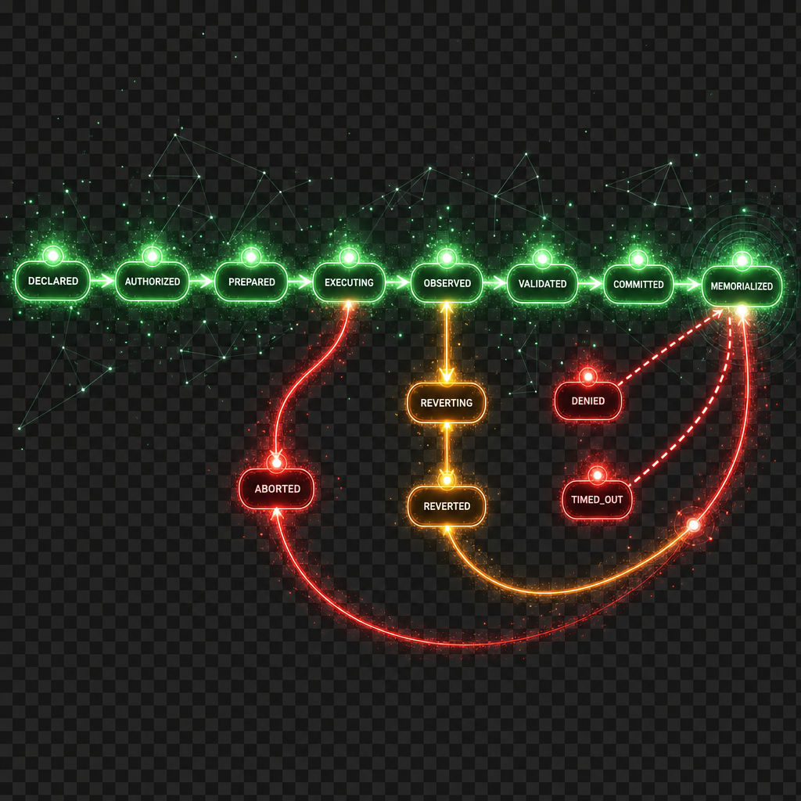

# Loom — Agent Framework

<p align="center">
  
</p>

> *A single thread may seem insignificant, but when many threads are precisely interwoven, they can be woven into any shape.*

**Loom** is a harness-first, memory-native, self-directing agent framework for anyone who cares not just about what an agent *can* do — but about what it *did*, who approved it, and what happens when it goes wrong.

---

## Why Loom?

Most agent frameworks treat tools as functions: define → call → done. That works in demos. It falls apart the moment you need audit trails, real authorization logic, OS-level sandboxing, long-term memory, or reliable autonomous operation.

Loom was built from a different premise: **every tool call is a first-class citizen with a lifecycle.**

Before a tool executes, it passes through a middleware pipeline that handles trust classification, schema validation, scope-aware authorization, and precondition gating. During execution, it races against abort signals. After execution, a post-validator can roll it back. Every state transition — success, failure, timeout, rollback — is recorded in memory and available for reflection.

This is what *harness engineering* means: the execution machinery around your tools is as important as the tools themselves.

---

## Core Values

| Principle | What it means |
|-----------|---------------|
| **Harness-first** | Every tool call flows through a structured middleware pipeline. Logging, tracing, trust control, and abort handling are built-in, not bolted on. |
| **Memory-native** | Memory is a substrate, not a plugin. Four types — episodic, semantic, procedural, relational — are core architecture, not an afterthought. |
| **Reflexive** | The agent observes its own execution history, self-assesses skill quality after each turn, and evolves low-performing skills automatically. |
| **Self-directing** | Cron, event, and condition triggers fire autonomously without human prompting. The autonomy engine shares the same middleware pipeline as interactive sessions. |
| **Model-agnostic** | Routes between cloud and local providers by model name prefix. Switch mid-session without losing context. |

---

## Architecture

Loom is organized into seven layers. Every tool call — whether from a human prompt, an autonomy schedule, or a sub-agent — passes through all of them.

<p align="center">
  
</p>

Large source files are navigable via **`# SECTION N`** banners — run `grep "# SECTION N" <file>` to jump directly to any major block.

---

## Harness Engineering

This is the core of what makes Loom different. Everything else — memory, autonomy, skills — sits on top of it.

### Three-Tier Trust

Every tool registered in Loom carries a trust level that determines how much human approval it requires:

| Level | Meaning | Behavior |
|-------|---------|----------|
| **SAFE** | Read-only, local, reversible | Pre-authorized at session start. Runs without prompting. |
| **GUARDED** | Writes, network access, side effects | Requires first-time confirmation; session-scoped approval persists. |
| **CRITICAL** | Destructive, irreversible, cross-system | Must confirm on every call. Cannot be session-authorized. |

Beyond trust levels, tools carry **capability flags** — `EXEC`, `NETWORK`, `AGENT_SPAN`, `MUTATES` — that give the middleware pipeline finer-grained control over what categories of action are permitted in any given context.

### Middleware Pipeline

All tool calls — regardless of origin — flow through the same ordered middleware chain, wrapped from outermost to innermost around the tool handler:

<p align="center">
  
</p>

| Layer | Responsibility |
|-------|----------------|
| **Lifecycle** (outermost) | Opens / closes the `ActionRecord`: `DECLARED` at entry, `MEMORIALIZED` at exit |
| **Log + Trace** | Rich-formatted terminal output; timing + episodic memory write |
| **SchemaValidation** | JSON schema validation; hallucinated-parameter guard |
| **BlastRadius** | Trust classification + user confirmation; writes authorization result to `LifecycleContext` |
| **LifecycleGate** (innermost) | Real-time control gates: `AUTHORIZED → PREPARED → EXECUTING → OBSERVED` |

Middleware is stackable and pluggable — you can inject custom middleware at any position via the plugin system.

### Action Lifecycle

Every tool call is wrapped in an `ActionRecord` that lives inside a deterministic state machine. These states are not just labels — they are **real-time control gates**: each transition must complete before execution proceeds.

<p align="center">
  
</p>

Terminal failure paths: `DENIED` / `ABORTED` / `TIMED_OUT` → always end in `MEMORIALIZED`.

This design means:
- **`AUTHORIZED`** — the pass/deny decision from `BlastRadiusMiddleware` is captured *before* dispatch, not inferred afterward
- **`PREPARED`** — skill-level precondition checks run here; failure aborts cleanly with zero side effects
- **`EXECUTING`** — fired at the *exact* moment the handler is called; races against an abort signal
- **`REVERTING → REVERTED`** — if a post-validator rejects the result, a registered rollback function can undo the effect
- **`MEMORIALIZED`** — every action, regardless of outcome, is written to memory and available for reflection

The two-layer design (`LifecycleMiddleware` outermost, `LifecycleGateMiddleware` innermost) exists for a precise reason: a single middleware cannot observe both *before* and *at* the exact moment the handler fires. Splitting into two cooperating layers solves this cleanly.

### Scope-Aware Authorization

Authorization in Loom operates at the **resource level**, not the tool level.

Instead of asking "do you approve `write_file`?", the system asks "do you approve writing under `doc/`?" — and remembers that answer.

```
write_file(path="doc/design.md")
    │
    ├─ scope_resolver → ScopeRequest(resource=path, action=write, selector=doc/)
    ├─ PermissionContext.evaluate()
    │     ├─ grant exists for doc/ → ALLOW (no prompt)
    │     ├─ no grant → CONFIRM (first-time prompt)
    │     └─ request is outside existing grant → EXPAND_SCOPE (red panel)
    └─ on confirmation → grant stored → future calls within scope auto-approve
```

Four response modes are available at every confirmation prompt: **approve once**, **scope lease (30-minute TTL)**, **permanent grant**, or **deny**. Active grants and their remaining TTL are always visible via `/scope` in any frontend.

### OS-Level Sandbox (Optional)

By default, `run_bash` is protected by pattern-based safety checks and confinement to the workspace directory. For projects that want a real isolation boundary — not just a tripwire — Loom can wrap every shell call with **Anthropic's [sandbox-runtime](https://github.com/anthropic-experimental/sandbox-runtime) (`srt`)**, enforcing filesystem and network restrictions at the OS kernel.

| Default install | With `[security.sandbox] backend = "srt"` |
|----------------|------------------------------------------|
| Pattern scan blocks known-dangerous shapes (curl-pipe-bash, `/dev/tcp`, base64 staged exec) | Same scan **plus an OS-level wall** |
| Shell confined to the workspace cwd | macOS `sandbox-exec` / Linux `bubblewrap` enforces every file write and every network call |
| Network calls succeed if the agent slips past pattern matching | Network blocked unless the domain is in your allowlist |
| File writes succeed anywhere the OS user can write | File writes blocked unless the path is in your allowlist |

No Docker required, one-line install:

```bash
npm install -g @anthropic-ai/sandbox-runtime
```

Then in `loom.toml`:

```toml
[security.sandbox]
backend         = "srt"
allow_write     = [".", "/private/tmp"]
deny_read       = ["~/.ssh", "~/.aws", "~/.gnupg", ".env"]
allowed_domains = ["pypi.org", "files.pythonhosted.org", "api.github.com"]
```

When enabled, an autonomy run that tries to `curl evil.com` simply cannot reach the network; a runaway script that tries to read `~/.ssh/id_rsa` gets `Operation not permitted` from the kernel. The agent sees the failure in its tool result and can adjust — but the action never reached your filesystem or your router.

Defaults to off so existing installs keep working byte-for-byte. Sessions fail closed at startup if the binary is missing rather than silently downgrading to no protection.

---

## Memory System

Loom's memory is not a key-value store bolted onto a chat loop. It is a four-type system with its own governance layer, all backed by a single SQLite WAL database with vector search via `sqlite-vec`.

### Four Memory Types

| Type | Role |
|------|------|
| **Episodic** | Timestamped log of what happened — every tool call, every turn, with full lifecycle metadata. Auto-compressed after a configurable threshold. |
| **Semantic** | Long-term factual beliefs with confidence scores and three-axis ontology (domain × temporal × confidence). Supports BM25 full-text search and embedding-based cosine similarity retrieval. |
| **Procedural** | Versioned skill instructions (`SkillGenome`). Quality tracked via EMA self-assessment; low-quality skills evolve or deprecate automatically. |
| **Relational** | Triple-store of entity relationships (`subject → predicate → object`). Powers cross-session reasoning and `dreaming` synthesis. |

### Multi-Fallback Recall

Memory retrieval is language-agnostic and always returns something:

```
recall(query)
  ├─ Tier 1: Embedding similarity (sqlite-vec)   — language-agnostic, semantic
  ├─ Tier 2: BM25 keyword ranking (SQLite FTS5)  — fast same-language path
  └─ Tier 3: Recency fallback                    — always returns a result
```

### Memory Governance

Every write to semantic memory passes through the `MemoryGovernor`:

```
write request
  ├─ classify_source()      → trust tier (user_explicit 1.0 → external 0.5)
  ├─ confidence floor       = max(entry.confidence, tier_floor)
  ├─ semantic-dup detect    → embedding cosine ≥ 0.85 vs recent facts → 3-way prompt (merge / replace / skip)
  ├─ time-window gate       → same source × topic within ~30s → throttle near-dup writes
  ├─ ContradictionDetector  → REPLACE / KEEP / SUPERSEDE based on trust comparison
  └─ upsert or reject

session end
  └─ Decay Cycle: episodic TTL prune · semantic low-confidence prune · relational dreaming decay
```

Semantic-dup detection and the time-window admission gate landed in v0.3.8.0 (PR #411); the existing `memorize` tool also surfaces near-duplicate hints at write time. Batch dedup is available through the `skills/memory_hygiene/` skill — running the cleanup against existing stores brought semantic fact counts down 6.6k → 5.7k (-13.8%).

Trust tiers (highest → lowest): `user_explicit` → `tool_verified` → `agent_memorize` → `session_compress` → `counter_factual` → `agent_inferred` → `skill_evolution` → `dreaming` → `external`

Semantic confidence has a 90-day half-life. Memories that are never reinforced fade. Contradictions from lower-trust sources are suppressed. The system gradually builds a coherent, stable belief state across sessions.

### MemoryPulse — Proactive Session Hooks

`MemoryPulse` (Issue #281 P3) surfaces proactive memory signals directly into the agent's context as `<system-reminder>` blocks at the start of each turn — without polluting session state:

- **Hook G — Session Preheat**: On session start, surfaces the previous session's top-3 `domain=project / temporal=milestone` facts by confidence. Silent no-op when no prior session or no recent milestones exist.
- **Hook A — Contradiction Notice**: On each `governed_upsert` that detects a contradiction, emits an old-vs-new diff once-per-key-per-session (gate via `memory_meta`). Clears at session start so the agent sees live contradictions again next session.

The remaining four hooks (E watermark / H skill hint / B decay warn / D dream inject) are deferred until G+A have run long enough to measure noise.

### MemoryLifecycle — Domain×Temporal Decay Table

v0.3.6+ introduced a structured decay matrix keyed by `(domain, temporal)`:

| domain | temporal | Decay trigger |
|--------|----------|--------------|
| knowledge | recent | Not decayed |
| knowledge | archived | 30-day decay cycle |
| project | recent | 45-day decay cycle |
| project | archived | 14-day decay cycle |
| self | any | Never decayed |
| user | any | Never decayed |

`MaintenanceLoop` (daemon-cron, Issue #281 P3-A) runs the decay table on a configurable interval with a `run()` throttle to prevent overlapping executions.

### Dream 2.0 — Themed Round-Robin Sampling

`dream_cycle` now supports themed sampling: the sampler rotates through non-empty domains on each call, ensuring relational facts are grounded in diverse fact-types rather than over-sampled from a single domain.

---

## Skills — Procedural Memory with Self-Evolution

Skills are versioned instruction sets stored in `SkillGenome` that follow a three-tier progressive disclosure model:

| Tier | When loaded | What it contains |
|------|-------------|-----------------|
| **Tier 1** | Session startup | Name + description injected into system prompt — minimal context cost |
| **Tier 2** | On demand via `load_skill()` | Full instruction body, evolution hints, resource list |
| **Tier 3** | As needed | Agent reads bundled scripts, references, and assets directly |

Drop a `SKILL.md` into your `skills/` directory — Loom auto-imports it at session start.

### Structured Diagnostic Feedback Loop

After each turn where a skill was used, `TaskReflector` runs a background LLM self-assessment that produces a `TaskDiagnostic` — a structured record of which instructions were followed or violated, failure and success patterns, concrete `skill_edit_suggestions`, and a `quality_score` (1–5). The score feeds into the skill's `confidence` via EMA (α = 0.15). Skills whose confidence drops below a configurable threshold are deprecated and removed from the Tier 1 catalog.

### Skill Optimization Loop

> v0.3.7.2 (Quest D Phase 1.C): the prior automated candidate-pool pipeline (`SkillMutator` / `SkillPromoter` / `SkillGate` / shadow_mode / fast_track) was retired. Process signals (tool success rate, verdict ratio, shadow delta) are not a credible proxy for skill output quality — without an Evaluator substrate, automated promotion is garbage-in/out. See [docs/designs/54-Skill-Evolution-Arena-設計.md](docs/designs/54-Skill-Evolution-Arena-設計.md).

Skills now improve through three observation channels, with **edits made by the user/agent in conversation** — git commits replace the old candidate/promote mechanism:

**1. Real-time feedback (in-conversation)**
- *System layer*: `ToolCallDimension` surfaces tool failure rate + anomalies inline during the turn — the user sees a skill stumbling without having to dig.
- *Conversation layer*: user observes → tells the agent → agent edits `SKILL.md` directly → `git commit`.

**2. Weekly worker** — pure SQL + template, no LLM
```bash
loom skill weekly                            # writes outputs/self_check/<date>-skill-weekly.md
loom skill weekly --days 30 --no-write       # print to stdout
```
The worker scans the ledger for the past window and renders a *該關注清單* with five structural codes: `muffled_run` / `undigested_feedback` / `abnormal_outcome` / `stale` / `exists_but_unused`. It does **not** score or rank skills — just surfaces structural observations for the user to act on.

**3. Conversational ledger pull** — `skill_review` agent tool
- The agent calls `skill_review(skill_id="code_weaver", days=7)` to pull per-skill activation episodes (load events + same-turn tool calls + memory writes + turn outcomes) from the ledger.
- Typical flow: user asks "回顧一下 X 技能最近的狀況" → agent reads the digest → discussion → agent edits `SKILL.md` based on the conversation.

Behind the scenes, `load_skill` / `unload_skill` calls now carry a `skill_id` on their `tool_lifecycle` ledger events (indexed by `idx_skill`), so per-skill queries are O(log n). The weekly worker and `skill_review` tool share a common query layer (`loom.core.skill_review.query_skill_ledger`).

### Precondition Checks — Framework-Enforced Safety Rails

Skill instructions tell the LLM what it *should* do. But a strongly-worded "never run `rm -rf`" in a SKILL.md is still just a suggestion — probabilistic compliance from a probabilistic system.

Precondition checks close this gap by moving safety rules from text into code that the harness executes at the `PREPARED` gate — before the tool handler ever sees the call:

| Without checks | With checks |
|---------------|-------------|
| "Don't run destructive commands" — LLM *might* comply | `reject_destructive_commands()` — framework **blocks** it |
| "This skill is read-only" — LLM *usually* respects it | `reject_write_operations()` — `write_file` is **impossible** while skill is active |
| "Only modify files in skills/" — LLM *tries* to follow | `require_skills_dir_target()` — paths outside `skills/` are **rejected** |

Each check is a lightweight async function defined in the skill's `checks.py`. Functions are mounted onto specific `ToolDefinition` objects when the skill loads, and unmounted when the skill is replaced. No cross-skill contamination. No global state mutation.

---

## Autonomy Engine

Loom can operate without a human in the loop. The autonomy engine supports three trigger types:

- **`CronTrigger`** — standard 5-field cron expressions with timezone support
- **`EventTrigger`** — fires on named events emitted anywhere in the system
- **`ConditionTrigger`** — evaluates a Python predicate against session state

The critical design point: autonomous sessions use the **same `MiddlewarePipeline`** as interactive sessions. There is no separate "auto mode" with relaxed permissions. Schedules declare which GUARDED tools they need in `allowed_tools`, and which resource scopes they pre-authorize in `scope_grants`. Anything not declared is denied — autonomy runs on a budget, not on trust.

An `ActionPlanner` maps the current trust level and context to a decision path. The agent never silently escalates its own permissions, and autonomous actions are always written to memory for post-hoc inspection.

`MaintenanceLoop` runs decay cycles and housekeeping tasks on a daemon-cron schedule, with a `run()` throttle that prevents overlapping executions.

---

## Platforms

Loom has three first-party frontends. The earlier Textual TUI was retired on 2026-05-19 (PR #404).

### CLI

`loom chat` opens an interactive session backed by a single persistent `prompt_toolkit` `LoomApp`. Linear streaming output, a floating **TaskList panel** with per-row `done_when` acceptance criteria, a runtime **heartbeat footer** that responds in real time as tools begin / stall / complete, and tool **justification prose** that surfaces *why* the agent is calling each tool.

`/sessions`, `/name`, `/model`, `/scope`, `/think`, `/compact` and friends are inline. `--resume` and `--session <id>` pick up where you left off.

### Discord Bot

`loom discord start` turns any channel thread into a persistent Loom session — built for mobile access and 24/7 autonomous operation. Each thread maps to one session and survives bot restart.

- **Envelope Trail** — every completed multi-tool batch freezes as a permanent message: agent-authored `▸ <intent>` header, per-node ✓/▸/○ glyphs, outcome row (`✓ fulfilled` / `◐ partial` / `⚠ unfulfilled` / `↪ pivoted` / `🛑 aborted`) with summary line
- **TaskList Reminder Embed** — italic `done when: ⋯` sub-line under each non-completed row; empty values render as `—`
- **Stalled-status proxy** — when a GUARDED tool is awaiting authorization the embed switches to `⏸ 等待授權` and suppresses heartbeat updates, so the UI never looks like agent thinking while it's actually waiting on the user
- **Confirm flow** — four buttons (Allow / Lease / Auto / Deny) with follow-up messages explaining grant scope and TTL
- **Slash commands** — `/scope`, `/summary`, `/model`, `/think`, `/compact` etc. land natively alongside text-prefix routing

### MCP — bidirectional bridge

Loom speaks [Model Context Protocol](https://modelcontextprotocol.io/) in both directions:

- **`loom mcp serve`** — exposes Loom's tool catalog to any MCP client (Claude Desktop, Cursor, Continue, …), so other agent platforms can drive Loom under the same trust hierarchy and lifecycle gates as a native session
- **`loom mcp connect <cmd>`** or `[[mcp.servers]]` in `loom.toml` — pulls external MCP servers' tools into the current session; each remote tool is registered into the same `ToolRegistry`, picks up the standard middleware pipeline, and is auto-prefixed to avoid collisions

The two ends share `loom/extensibility/mcp_{server,client}.py`. Connected clients are tracked on `session._mcp_clients` and cleaned up at `session.stop()`.

---

## Installation

```bash
# Requires Python 3.11+
git clone https://github.com/Dakai666/Loom.git
cd Loom
pip install -e ".[dev]"
```

Pick a starting configuration by copying one of the templates under
[`examples/profiles/`](examples/profiles/) into `loom.toml` at the repo root:

| Profile | When to use |
|---------|-------------|
| `loom.toml.example.secure` | 企業 / 高敏感資料 / 純 CLI — OS-level sandbox + 網路 allowlist + autonomy 關 |
| `loom.toml.example.assistant` | 7×24 Discord 助手（**主要推薦**）— Discord bot 主場、autonomy 關、預設安全等級 |
| `loom.toml.example.autonomous` | 自主智能體 / 獨立設備 / 容器 — autonomy 全開 + scope_grants 預先批准（⚠ 高風險） |

```bash
cp examples/profiles/loom.toml.example.assistant loom.toml   # 主要推薦
# 或從根目錄的 loom.toml.example 起步 (dev baseline, 含所有 per-key 教學註解)
```

Create a `.env` in the project root with at least one provider:

```env
OPENAI_API_KEY=your_openai_key_here
ANTHROPIC_API_KEY=your_key_here

# Discord bot (required by assistant / autonomous profiles)
DISCORD_BOT_TOKEN=your_bot_token_here

# Local providers (no API key needed)
OLLAMA_BASE_URL=http://localhost:11434/v1
LMSTUDIO_BASE_URL=http://localhost:1234/v1
```

```bash
loom auth openai                  # Codex CLI login helper + OPENAI_API_KEY setup
loom chat                          # interactive CLI
loom chat --model gpt-5.5          # OpenAI model
loom chat --model codex/gpt-5.5    # Codex OAuth backend
loom chat --model ollama/llama3.2  # local model
loom discord start --autonomy --channel <id>
loom autonomy start
```

To pull and upgrade in one step (handles `pyproject.toml` changes):

```bash
make update                       # = git pull && pip install -e ".[dev]"
```

Model routing works by prefix — `gpt-*` and `openai/<model>` use
`OPENAI_API_KEY`, while `codex/<model>` uses the Codex OAuth token from
`codex login`. Other prefixes include `claude-*`, `ollama/<name>`,
`lmstudio/<name>`, and `MiniMax-*`. Switch mid-session with `/model`.

Image generation is opt-in via `[tools.image]` in `loom.toml`. When configured
with `default_provider = "openai"`, Loom exposes the canonical
`image_generate` tool backed by `gpt-image-2` and writes a PNG/WebP/JPEG under
the workspace. With Codex OAuth it uses the Codex Responses backend and
supports workspace image `subject_reference` anchors; with `OPENAI_API_KEY` it
uses the OpenAI Images API.

---

## Further Reading

The `doc/` directory contains full technical documentation for every subsystem:

| Topic | File |
|-------|------|
| System overview & glossary | `doc/00-總覽.md`, `doc/01-名詞解釋.md` |
| Harness & middleware deep-dive | `doc/04-Harness-概述.md`, `doc/06-Middleware-詳解.md` |
| Action Lifecycle state machine | `doc/06b-Action-Lifecycle.md` |
| Trust levels & blast radius | `doc/05-Trust-Level.md` |
| Scope-aware authorization design | `docs/designs/44-Scope-Aware-Permission-規劃.md` |
| OS-level sandbox (`srt`) | `doc/55-Sandbox-Runtime.md` |
| Memory system & governance | `doc/08-Memory-概述.md`, `doc/08b-Memory-Governance.md` |
| Skill Genome & self-assessment | `doc/10-Skill-Genome.md`; `docs/designs/54-Skill-Evolution-Arena-設計.md` (current). `doc/10b-Skill-Evolution.md` retired by Phase 1.C |
| Memory Pulse & Lifecycle | `doc/12b-Memory-Health.md` |
| Execution visualization | `docs/designs/43-Harness-Execution-可視化規劃.md` |
| Autonomy engine | `doc/19-Autonomy-概述.md`, `doc/21-Action-Planner.md` |
| Extensibility & plugins | `doc/29-Extensibility-概述.md`, `doc/31-Plugin-系統.md` |
| MCP server / client implementation | `doc/31b-MCP-Server-實作.md` |
| Full config reference | `doc/37-loom-toml-參考.md` |

---

## Version History

| Version | Date | Highlights |
|---------|------|-----------|
| **v0.3.8.1** | 2026-05-23 | Lens import family retired (`loom import` CLI · `Hermes`/`OpenAI` lenses removed); extensibility surface convergence to `@loom.tool` / `LoomPlugin` / MCP (PR #442) |
| **v0.3.8.0** | 2026-05-21 | Interaction Language UI/UX overhaul (envelope intent/outcome render, CLI heartbeat, stalled-status proxy); TaskList v2 with `done_when` acceptance criterion; semantic-dup admission gate; three-round system audit; Textual TUI subsystem retired |
| **v0.3.7.5** | 2026-05-18 | OS-level sandbox for `run_bash` via Anthropic's `sandbox-runtime` — opt-in kernel-level filesystem + network confinement (Quest A · Issue #29) |
| **v0.3.6.2** | 2026-05-05 | Fix spurious asyncio.Future() in render-only tests |
| **v0.3.6.1** | 2026-05-01 | Skill-driven model tier system (Issue #276) |
| **v0.3.6.0** | 2026-04-29 | LLM-as-judge Phase 2 (verdicts + turn hooks); CLI Refresh E (TaskList floating panel); Envelope three-stage fade |
| **v0.3.5.1** | 2026-04-22 | Anthropic prompt caching with hit% display; per-file probe tracking; `probe_file` tool |
| **v0.3.4.0** | 2026-04-16 | `MemoryFacade` Phase A–C; `TaskReflector`; SubAgent structured failure codes; startup diagnostic suite |

For releases prior to v0.3.4.0 see the [GitHub releases page](https://github.com/Dakai666/Loom/releases).

---

## License

MIT
